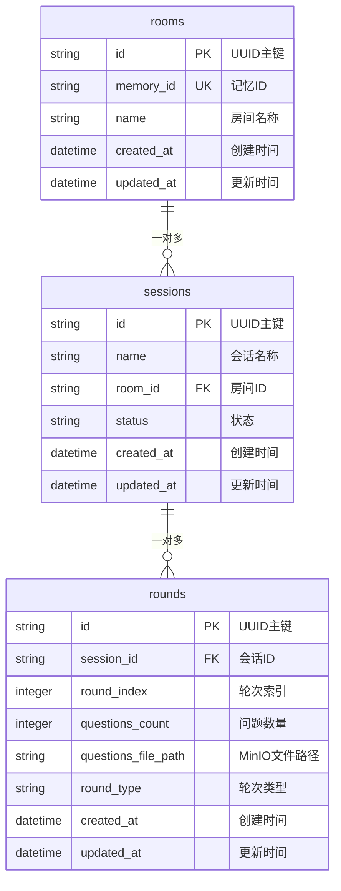

# Yeying面试官系统 - 数据库表结构文档

## 数据库配置

**数据库类型:** SQLite  
**ORM框架:** Peewee  
**数据库文件:** `data/yeying_interviewer.db`  
**字符编码:** UTF-8  

## 表结构概览

系统采用三层架构设计：面试间 → 面试会话 → 对话轮次



---

## 表详细定义

### 1. 面试间表 (rooms)

**表名:** `rooms`  
**用途:** 存储面试间基本信息，作为顶层容器

| 字段名 | 数据类型 | 约束 | 默认值 | 说明 |
|--------|----------|------|--------|------|
| id | VARCHAR | PRIMARY KEY | UUID | 面试间唯一标识符 |
| memory_id | VARCHAR | UNIQUE | `memory_{id前8位}` | 面试间记忆ID，用于显示 |
| name | VARCHAR | NOT NULL | "面试间" | 面试间名称 |
| created_at | DATETIME | NOT NULL | NOW() | 创建时间 |
| updated_at | DATETIME | NOT NULL | NOW() | 最后更新时间 |

**索引:**
- PRIMARY KEY: `id`
- UNIQUE KEY: `memory_id`

**示例数据:**
```json
{
  "id": "f96acbee-728e-42cf-baec-920621e5ffda",
  "memory_id": "memory_f96acbee",
  "name": "面试间",
  "created_at": "2025-09-15T12:00:00",
  "updated_at": "2025-09-15T12:00:00"
}
```

---

### 2. 面试会话表 (sessions)

**表名:** `sessions`  
**用途:** 存储面试会话信息，隶属于特定面试间

| 字段名 | 数据类型 | 约束 | 默认值 | 说明 |
|--------|----------|------|--------|------|
| id | VARCHAR | PRIMARY KEY | UUID | 会话唯一标识符 |
| name | VARCHAR | NOT NULL | - | 会话名称，如"面试会话1" |
| room_id | VARCHAR | FOREIGN KEY | - | 所属面试间ID |
| status | VARCHAR | NOT NULL | "active" | 会话状态 |
| created_at | DATETIME | NOT NULL | NOW() | 创建时间 |
| updated_at | DATETIME | NOT NULL | NOW() | 最后更新时间 |

**外键约束:**
- `room_id` REFERENCES `rooms(id)`

**状态枚举:**
- `active`: 进行中
- `completed`: 已完成
- `paused`: 已暂停

**索引:**
- PRIMARY KEY: `id`
- INDEX: `room_id`

**示例数据:**
```json
{
  "id": "37fd2c88-172a-48e8-92b8-6225377116a6",
  "name": "面试会话1",
  "room_id": "f96acbee-728e-42cf-baec-920621e5ffda",
  "status": "active",
  "created_at": "2025-09-15T12:05:00",
  "updated_at": "2025-09-15T12:05:00"
}
```

---

### 3. 对话轮次表 (rounds)

**表名:** `rounds`  
**用途:** 存储对话轮次信息，每轮包含一批面试问题

| 字段名 | 数据类型 | 约束 | 默认值 | 说明 |
|--------|----------|------|--------|------|
| id | VARCHAR | PRIMARY KEY | UUID | 轮次唯一标识符 |
| session_id | VARCHAR | FOREIGN KEY | - | 所属会话ID |
| round_index | INTEGER | NOT NULL | - | 轮次索引 (0,1,2...) |
| questions_count | INTEGER | NOT NULL | 0 | 本轮问题数量 |
| questions_file_path | VARCHAR | NOT NULL | - | MinIO中问题文件路径 |
| round_type | VARCHAR | NOT NULL | "ai_generated" | 轮次类型 |
| created_at | DATETIME | NOT NULL | NOW() | 创建时间 |
| updated_at | DATETIME | NOT NULL | NOW() | 最后更新时间 |

**外键约束:**
- `session_id` REFERENCES `sessions(id)`

**轮次类型枚举:**
- `ai_generated`: AI生成
- `manual`: 手动创建

**文件路径格式:**
- `data/questions_round_{round_index}_{session_id}.json`

**索引:**
- PRIMARY KEY: `id`
- INDEX: `session_id`
- INDEX: `(session_id, round_index)` - 复合索引

**示例数据:**
```json
{
  "id": "8a1b2c3d-4e5f-6789-abcd-ef0123456789",
  "session_id": "37fd2c88-172a-48e8-92b8-6225377116a6",
  "round_index": 0,
  "questions_count": 9,
  "questions_file_path": "data/questions_round_0_37fd2c88-172a-48e8-92b8-6225377116a6.json",
  "round_type": "ai_generated",
  "created_at": "2025-09-15T12:10:00",
  "updated_at": "2025-09-15T12:10:00"
}
```

---

## 数据关系

### 层级关系
```
面试间 (Room)
├── 面试会话1 (Session)
│   ├── 轮次0 (Round) → questions_round_0_session1.json
│   ├── 轮次1 (Round) → questions_round_1_session1.json
│   └── 轮次2 (Round) → questions_round_2_session1.json
├── 面试会话2 (Session)
│   └── 轮次0 (Round) → questions_round_0_session2.json
```

### 外键关系
- `sessions.room_id` → `rooms.id` (多对一)
- `rounds.session_id` → `sessions.id` (多对一)

### 级联操作
- 删除面试间 → 级联删除所有相关会话和轮次
- 删除会话 → 级联删除所有相关轮次

---

## 数据存储策略

### 混合存储架构

| 数据类型 | 存储位置 | 说明 |
|----------|----------|------|
| **元数据** | SQLite数据库 | 房间、会话、轮次的基本信息 |
| **问题内容** | MinIO对象存储 | 实际的面试问题JSON文件 |
| **简历数据** | MinIO对象存储 | 候选人简历信息 |

### 存储优势
- 🏃‍♂️ **查询性能** - 元数据查询快速
- 💾 **存储效率** - 大文件存储在对象存储
- 🔄 **数据一致性** - 关系型数据保证一致性
- 📈 **扩展性** - 对象存储支持大规模文件

---

## 数据库维护

### 自动字段更新
所有表继承 `BaseModel`，自动维护：
- `created_at`: 记录创建时间
- `updated_at`: 记录最后更新时间（每次保存时自动更新）

### 数据库初始化
```python
from backend.models.models import init_database
init_database()  # 创建所有表
```

### 连接配置
```python
DATABASE_PATH = os.getenv('DATABASE_PATH', 'data/yeying_interviewer.db')
database = SqliteDatabase(DATABASE_PATH)
```

---

## 查询示例

### 获取房间统计
```python
# 获取房间及其统计信息
room = Room.get_by_id(room_id)
sessions_count = room.sessions.count()
total_rounds = sum(session.rounds.count() for session in room.sessions)
```

### 获取会话的所有轮次
```python
# 获取会话的所有轮次，按索引排序
rounds = Round.select().where(Round.session == session).order_by(Round.round_index)
```

### 复杂统计查询
```python
# 获取系统总统计
total_rooms = Room.select().count()
total_sessions = Session.select().count()
total_rounds = Round.select().count()
total_questions = Round.select(fn.SUM(Round.questions_count)).scalar()
```

---

*文档更新时间: 2025-09-15*  
*数据库版本: v1.0*